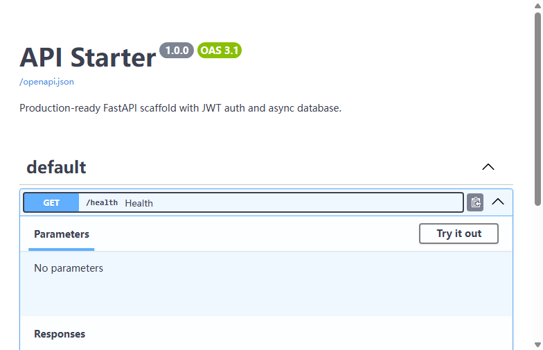
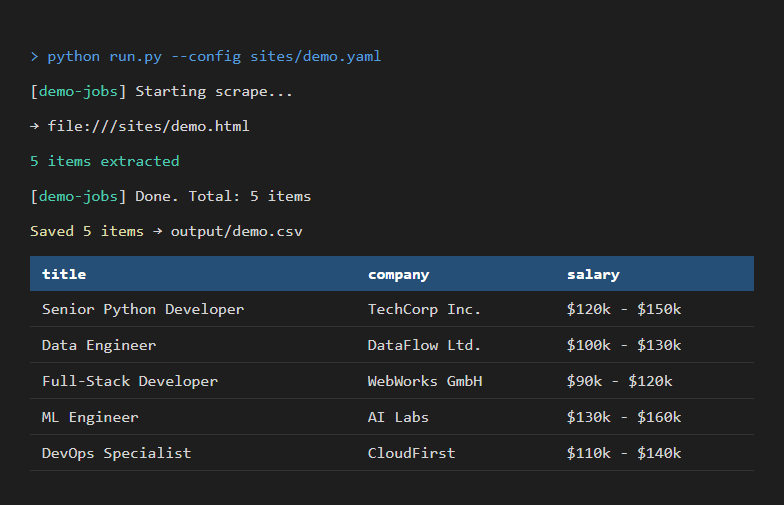

# Ck.epsilon — Freelance Portfolio / 自由职业作品集

> Python Backend · Web Scraping · Frontend Dashboards  
> Python 后端 · 数据采集 · 前端管理面板

[English](#english) | [中文](#中文)

---

## English

### About

Full-stack developer specializing in Python REST APIs, web scraping pipelines, and modern admin dashboards. Clean code, production-ready, bilingual documentation.

### Supported Environments

| Category | Requirement | Tested |
|----------|------------|--------|
| OS | Windows 10+, macOS 12+, Linux (Ubuntu 20.04+) | Windows 11 ✅ |
| Python | 3.10+ | 3.10.20 ✅ |
| Node.js | 18+ | 24.15.0 ✅ |
| npm | 9+ | 11.12.1 ✅ |
| Browser | Chromium (for Playwright) | Edge/Chrome ✅ |

### Sample Projects

#### 1. REST API Starter — [api-starter/](./api-starter)
Production-ready FastAPI scaffold with JWT auth, async SQLAlchemy, Swagger docs.

#### 2. Web Scraper Template — [scraper-template/](./scraper-template)
Multi-site async scraper with Playwright, anti-detection, CSV/JSON export.

#### 3. Admin Dashboard — [admin-dashboard/](./admin-dashboard)
React + TypeScript + Ant Design dashboard with dark mode, charts, data tables.

### Tech Stack

| Layer | Technologies |
|-------|-------------|
| Backend | Python (FastAPI, Flask), REST APIs, JWT Auth |
| Data | Playwright, Requests, Pandas, ETL Pipelines |
| Frontend | React 18, TypeScript, Ant Design 5, Recharts |
| Database | PostgreSQL, MySQL, SQLite, Redis |
| DevOps | Docker, Git, GitHub Actions |

### Contact

- GitHub: [@Ck-epsilon](https://github.com/Ck-epsilon)
- Email: Ck.epsilon@outlook.com
- Available on Fiverr & Upwork

---

## 中文

### 关于

全栈开发者，专注 Python REST API、数据采集管道和现代化管理面板。代码整洁，可直接投产，文档中英双语。

### 支持环境

| 类别 | 要求 | 实测 |
|------|------|------|
| 操作系统 | Windows 10+, macOS 12+, Linux (Ubuntu 20.04+) | Windows 11 ✅ |
| Python | 3.10+ | 3.10.20 ✅ |
| Node.js | 18+ | 24.15.0 ✅ |
| npm | 9+ | 11.12.1 ✅ |
| 浏览器 | Chromium (Playwright用) | Edge/Chrome ✅ |

### 示例项目

| 项目 | 描述 | 技术栈 |
|------|------|--------|
| [API 后端脚手架](./api-starter) | FastAPI + JWT认证 + 异步数据库 | Python, FastAPI, SQLAlchemy 2.0 |
| [爬虫模板](./scraper-template) | Playwright 多站采集 + 反检测 | Python, Playwright, Pandas |
| [管理面板](./admin-dashboard) | React + Ant Design 暗色模式 | TypeScript, React 18, Ant Design 5 |

### 联系方式

- GitHub: [@Ck-epsilon](https://github.com/Ck-epsilon)
- 邮箱: Ck.epsilon@outlook.com
- Fiverr & Upwork 可用
