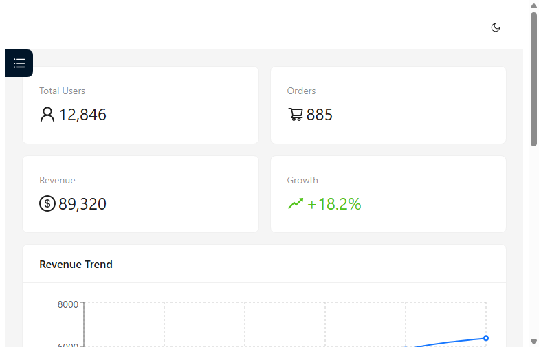
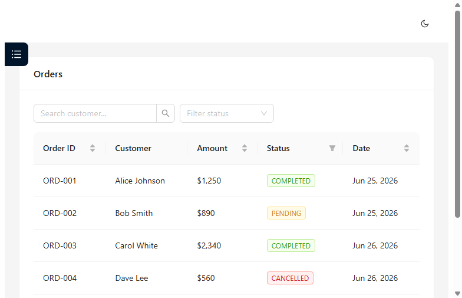

# Admin Dashboard — React + Ant Design / 管理面板

[English](#english) | [中文](#中文)

---

## English

  

Responsive admin dashboard with dark/light mode, KPI charts, and a searchable data table. Production template, not a tutorial demo.

### Supported Environment

| Software | Required | Tested |
|----------|----------|--------|
| Node.js | 18+ | 24.15.0 ✅ |
| npm | 9+ | 11.12.1 ✅ |
| React | 18+ | 18.x ✅ |
| TypeScript | 5+ | ✅ |
| Ant Design | 5+ | ✅ |

### Quick Start

```bash
npm install
npm run dev
```

Open http://localhost:3000.

> See `package.json` for full dependency details.

**→ [Open Live Preview](preview.html)** — full dashboard mockup with working dark mode

### Project Structure

```
admin-dashboard/
├── src/
│   ├── main.tsx              # Entry point
│   ├── App.tsx               # Layout, sidebar, routing, dark mode
│   └── components/
│       ├── Dashboard.tsx     # KPI cards + line/bar charts
│       └── DataTable.tsx     # Searchable, filterable table
├── screenshots/              # Demo screenshots
├── package.json
├── vite.config.ts
└── README.md
```

### Features

- **Dark / Light mode** — Single toggle, Ant Design theme-aware
- **Responsive sidebar** — Collapses on mobile
- **KPI dashboard** — Revenue, users, orders with charts (Recharts)
- **Data table** — Search, filter, sort, paginate
- **TypeScript** — Full type safety
- **Routing** — React Router 6

### Screenshots

| Dashboard | Data Table |
|-----------|------------|
|  |  |

> 🎬 **Dark mode demo:** [screenshots/dark-mode.mp4](./screenshots/dark-mode.mp4) — 15-second toggle + table sort walkthrough

### Customizing Data Sources

Replace demo data with your own API:

1. Open `src/components/Dashboard.tsx`
2. Replace `kpiData` with `await fetch('/api/your-endpoint')` in `useEffect`
3. Open `src/components/DataTable.tsx`
4. Replace `mockOrders` with your API response
5. Update chart labels and table columns to match your data schema

> All data structures are typed — TypeScript will guide the integration.

---

## 中文

### 支持环境

| 软件 | 要求版本 | 实测 |
|------|---------|------|
| Node.js | 18+ | 24.15.0 ✅ |
| npm | 9+ | 11.12.1 ✅ |
| React | 18+ | 18.x ✅ |
| TypeScript | 5+ | ✅ |
| Ant Design | 5+ | ✅ |

### 快速启动

```bash
npm install
npm run dev
```

访问 http://localhost:3000。

### 项目结构

```
admin-dashboard/
├── src/
│   ├── main.tsx              # 入口
│   ├── App.tsx               # 布局/侧边栏/路由/暗色模式
│   └── components/
│       ├── Dashboard.tsx     # KPI 卡片 + 折线/柱状图
│       └── DataTable.tsx     # 可搜索/筛选的订单表格
├── screenshots/              # 演示截图
├── package.json
├── vite.config.ts
└── README.md
```

### 功能

- **暗色/亮色模式** — 一键切换，Ant Design 主题联动
- **响应式侧边栏** — 移动端自动折叠
- **KPI 仪表盘** — 收入/用户/订单统计 + Recharts 图表
- **数据表格** — 客户搜索、状态筛选、字段排序、分页
- **TypeScript** — 全类型安全
- **路由** — React Router 6

### 自定义数据源

将 Demo 数据替换为你自己的 API：

1. 打开 `src/components/Dashboard.tsx`
2. 在 `useEffect` 中将 `kpiData` 替换为 `await fetch('/api/你的接口')`
3. 打开 `src/components/DataTable.tsx`
4. 将 `mockOrders` 替换为你的 API 响应
5. 更新图表标签和表格列名以匹配你的数据结构

> 所有数据结构都有 TypeScript 类型定义，IDE 会引导你完成集成。

### 技术栈

| 层级 | 选择 |
|------|------|
| 框架 | React 18 + TypeScript |
| 构建 | Vite 5 |
| UI库 | Ant Design 5 |
| 图标 | @ant-design/icons |
| 图表 | Recharts |
| 路由 | React Router 6 |

---

*Author: Ck.epsilon*
