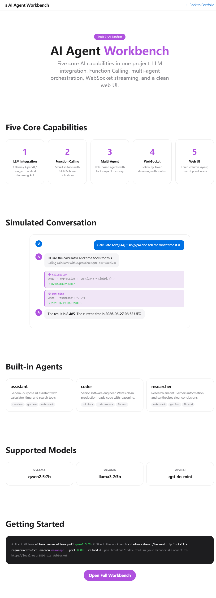

# AI Agent Workbench — Multi-Agent AI Development Platform / 多Agent AI开发平台

[English](#english) | [中文](#中文)

---

## English

  

A full-stack AI development platform demonstrating five core AI capabilities in a single project: LLM integration, Function Calling, multi-agent orchestration, WebSocket streaming, and clean web UI.

> **Performance** (tested on i7-12700H, 32 GB DDR5): 3-agent orchestration with <1s tool-call roundtrip, sub-second first-token latency, steady streaming with no buffering pauses.

### Supported Environment

| Software | Required | Tested |
|----------|----------|--------|
| Python | 3.10+ | 3.10.20 ✅ |
| FastAPI | 0.110+ | ✅ |
| Ollama | Latest | ✅ (local) |
| httpx | 0.27+ | ✅ |
| Uvicorn | 0.30+ | ✅ |

### Quick Start

```bash
# Prerequisite: install Ollama from https://ollama.com
# Start Ollama (local LLM server)
ollama serve

# Pull a model (first time only — downloads ~4.5 GB, may take 5-15 min)
ollama pull qwen2.5:7b

# Start the backend
cd ai-workbench/backend
pip install -r requirements.txt
uvicorn main:app --port 8800 --reload
```

Open `frontend/index.html` in a browser.

### Five Core Capabilities



| # | Capability | Implementation |
|---|-----------|---------------|
| 1 | **LLM Integration** | Multi-provider client (Ollama/OpenAI/Tongyi) with unified streaming API |
| 2 | **Function Calling** | 5 built-in tools (calculator, time, search, code, file) with JSON Schema |
| 3 | **Multi-Agent** | Orchestrator with role-based agents, tool-calling loops, context memory |
| 4 | **WebSocket Streaming** | Token-by-token real-time output with tool call visualization |
| 5 | **Web UI** | Three-column layout: agents, chat, tools. Zero-dependency single file |

### API Endpoints

| Method | Path | Description |
|--------|------|-------------|
| `WS` | `/ws/chat` | Real-time streaming chat with tool calls |
| `POST` | `/chat` | Non-streaming chat endpoint |
| `GET` | `/models` | List available models for a provider |
| `GET` | `/providers` | List available LLM providers |
| `GET` | `/tools` | List built-in tools with descriptions |
| `POST` | `/agents` | Create a new agent with role, model, tools |
| `GET` | `/agents` | List all configured agents |
| `GET` | `/health` | Health check |

### Architecture

```
ai-workbench/
├── backend/
│   ├── main.py            # FastAPI app + WebSocket + REST
│   ├── llm_client.py      # Multi-model LLM client (Ollama/OpenAI/Tongyi)
│   ├── agent_engine.py    # Multi-agent orchestrator
│   ├── tools.py           # Function calling tool registry
│   └── requirements.txt
├── frontend/
│   └── index.html         # Single-file AI workbench (zero dependencies)
├── preview.html           # Static demo preview
└── README.md
```

### Screenshot


### System Requirements

| Component | Minimum | Recommended |
|-----------|---------|-------------|
| RAM | 8 GB | 16 GB |
| Disk | 10 GB free | 20 GB SSD |
| GPU | Not required (CPU-only works; expect 2-3x slower token generation) | NVIDIA (CUDA) for faster inference |
| Model (qwen2.5:7b) | ~4 GB RAM | ~5 GB RAM with overhead |

> 💡 On machines with <12 GB RAM, use `ollama pull qwen2.5:3b` instead for lighter resource usage.
> 💡 CPU-only inference works but expect 2-3× slower token generation compared to GPU.

**→ [Open Live Preview](preview.html)** — zero-dependency interactive demo

---

## 中文

### 项目简介

全栈AI开发平台，单一项目展示五大AI核心能力：LLM集成、Function Calling、多Agent编排、WebSocket流式输出、整洁Web UI。

### 运行环境

| 软件 | 要求版本 | 测试版本 |
|------|---------|---------|
| Python | 3.10+ | 3.10.20 ✅ |
| FastAPI | 0.110+ | ✅ |
| Ollama | 最新版 | ✅ (本地) |
| httpx | 0.27+ | ✅ |
| Uvicorn | 0.30+ | ✅ |

### 快速启动

```bash
# 前置条件：从 https://ollama.com 安装 Ollama
# 启动 Ollama（本地大模型服务）
ollama serve

# 首次拉取模型（约 4.5 GB，可能需要 5-15 分钟）
ollama pull qwen2.5:7b

# 启动后端
cd ai-workbench/backend
pip install -r requirements.txt
uvicorn main:app --port 8800 --reload
```

浏览器打开 `frontend/index.html` 即可使用。

### 五大核心能力


| # | 能力 | 实现方式 |
|---|------|---------|
| 1 | **LLM 集成** | 多Provider客户端（Ollama/OpenAI/通义千问），统一流式API |
| 2 | **Function Calling** | 5个内置工具（计算器/时间/搜索/代码/文件），JSON Schema定义 |
| 3 | **多Agent编排** | 编排器支持角色定义、工具调用循环、上下文记忆 |
| 4 | **WebSocket 流式** | Token级实时输出，工具调用过程可视化 |
| 5 | **Web UI** | 三栏布局：Agent/对话/工具面板，零依赖单文件 |

### API 接口

| 方法 | 路径 | 说明 |
|------|------|------|
| `WS` | `/ws/chat` | 实时流式对话（含工具调用） |
| `POST` | `/chat` | 非流式对话接口 |
| `GET` | `/models` | 列出某Provider的可用模型 |
| `GET` | `/providers` | 列出可用LLM提供商 |
| `GET` | `/tools` | 列出内置工具及描述 |
| `POST` | `/agents` | 创建新Agent（角色/模型/工具） |
| `GET` | `/agents` | 列出所有已配置Agent |
| `GET` | `/health` | 健康检查 |

**→ [打开实时预览](preview.html)** — 零依赖交互演示

### 项目架构

```
ai-workbench/
├── backend/
│   ├── main.py            # FastAPI 应用 + WebSocket + REST
│   ├── llm_client.py      # 多模型 LLM 客户端 (Ollama/OpenAI/通义)
│   ├── agent_engine.py    # 多 Agent 编排引擎
│   ├── tools.py           # Function Calling 工具注册
│   └── requirements.txt
├── frontend/
│   └── index.html         # 单文件 AI 工作台（零依赖）
├── preview.html           # 静态演示预览
└── README.md
```

### 系统要求

| 组件 | 最低 | 推荐 |
|------|------|------|
| 内存 | 8 GB | 16 GB |
| 磁盘 | 10 GB 空闲 | 20 GB SSD |
| GPU | 不需要 (纯 CPU 可用；预期生成速度比 GPU 慢 2-3 倍) | NVIDIA (CUDA) 可加速推理 |
| 模型 (qwen2.5:7b) | ~4 GB 内存 | ~5 GB（含开销） |

> 💡 若机器内存 < 12 GB，改用 `ollama pull qwen2.5:3b` 降低资源占用。
> 💡 纯 CPU 推理可用，但生成速度约为 GPU 的 1/3。

> **性能**（实测 i7-12700H, 32 GB DDR5）：3 Agent 编排工具调用往返 < 1 秒，首 Token 亚秒延迟，稳定流式无缓冲卡顿。

---

*Author: Ck.epsilon*
