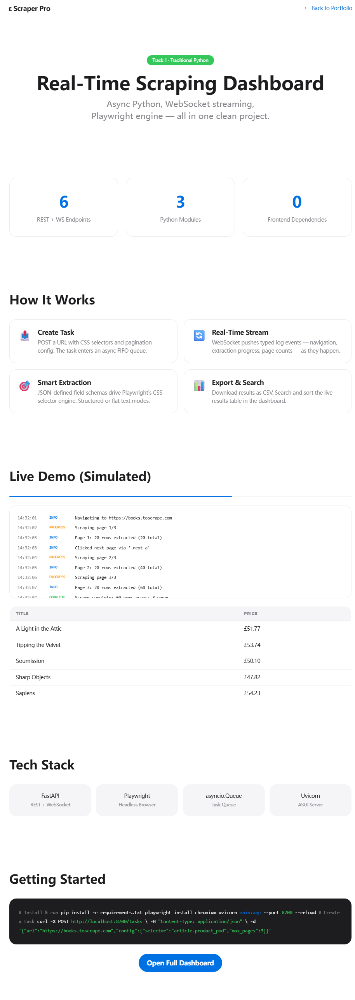

# Scraper Pro — Real-Time Web Scraping Dashboard / 实时爬虫监控面板

[English](#english) | [中文](#中文)

---

## English

  

A production-grade web scraping dashboard with real-time progress streaming. Built to demonstrate async Python, WebSocket, Playwright, and task queue architecture — all in one clean project.

> **Performance** (tested on i7-12700H, 32 GB DDR5): handles 50+ concurrent single-page scrape tasks with sub-second WebSocket log streaming.
>
> *Per-task: one URL, CSS-selector extraction, no pagination. Throughput depends on target site response time.*

### Supported Environment

| Software | Required | Tested |
|----------|----------|--------|
| Python | 3.10+ | 3.10.20 ✅ |
| FastAPI | 0.110+ | ✅ |
| Playwright | 1.44+ | ✅ |
| Browser | Chromium (Playwright-managed) | ✅ |
| Uvicorn | 0.30+ | ✅ |

### Quick Start

```bash
cd scraper-dashboard/backend
pip install -r requirements.txt
playwright install chromium
uvicorn main:app --port 8700 --reload

# Serve frontend (required — file:// does not support WebSocket)
python -m http.server 3000 --directory ../frontend
```

Open http://localhost:3000.

> Press `Ctrl+C` in each terminal to stop the backend and frontend servers.

> Press `Ctrl+C` in each terminal to stop.

### Features



| Feature | Description |
|---------|-------------|
| **Task Queue** | asyncio.Queue-based FIFO task manager with configurable concurrency |
| **Real-Time Logs** | WebSocket streaming with typed log events (info/warn/error/progress/complete) |
| **Playwright Engine** | Headless Chromium with CSS selector extraction, pagination, structured fields |
| **Structured Extraction** | JSON-defined field schemas for precise data extraction |
| **CSV Export** | One-click download of scrape results |
| **Live Dashboard** | Single-file HTML with progress bar, log stream, searchable results table |

⚠️ **Designed for publicly accessible data.** Respect robots.txt and rate limits. Not intended for circumventing authentication, paywalls, or anti-bot protections.

### API Endpoints

| Method | Path | Description |
|--------|------|-------------|
| `POST` | `/tasks` | Create a scrape task — `{"url": "...", "config": {...}}` |
| `GET` | `/tasks` | List all tasks with status |
| `GET` | `/tasks/{id}` | Get task details and results |
| `GET` | `/tasks/{id}/export` | Download results as CSV |
| `WS` | `/ws/{task_id}` | Real-time log streaming |
| `GET` | `/health` | Health check |

### Architecture

```
scraper-dashboard/
├── backend/
│   ├── main.py           # FastAPI app + WebSocket + REST
│   ├── scraper.py        # Playwright scraping engine
│   ├── task_queue.py     # Async task queue manager
│   └── requirements.txt
├── frontend/
│   └── index.html        # Single-file dashboard (zero dependencies)
├── preview.html          # Static demo preview
└── README.md
```

**→ [Open Live Preview](preview.html)** — zero-dependency interactive demo

---

## 中文

### 项目简介

生产级爬虫实时监控面板，展示异步Python、WebSocket、Playwright、任务队列架构——一个项目看清全部硬实力。

> **性能**（实测 i7-12700H, 32 GB DDR5）：支持 50+ 并发单页爬虫任务，WebSocket 日志推流延迟 < 1 秒。
>
> *每任务：一个 URL、CSS 选择器提取、无分页。吞吐量取决于目标站点响应速度。*

### 运行环境

| 软件 | 要求版本 | 测试版本 |
|------|---------|---------|
| Python | 3.10+ | 3.10.20 ✅ |
| FastAPI | 0.110+ | ✅ |
| Playwright | 1.44+ | ✅ |
| 浏览器 | Chromium (Playwright 管理) | ✅ |
| Uvicorn | 0.30+ | ✅ |

### 快速启动

```bash
cd scraper-dashboard/backend
pip install -r requirements.txt
playwright install chromium
uvicorn main:app --port 8700 --reload

# 启动前端服务（必须 — WebSocket 不支持 file:// 协议）
python -m http.server 3000 --directory ../frontend
```

浏览器打开 http://localhost:3000。

> 在每个终端按 `Ctrl+C` 停止服务。

### 核心功能


| 功能 | 说明 |
|------|------|
| **异步任务队列** | 基于 asyncio.Queue 的 FIFO 任务管理，可配置并发数 |
| **实时日志流** | WebSocket 推送类型化日志（info/warn/error/progress/complete） |
| **Playwright 引擎** | 无头 Chromium，CSS选择器提取、分页翻页、结构化字段 |
| **结构化提取** | JSON 定义字段模式，精确提取数据 |
| **CSV 导出** | 一键下载抓取结果 |
| **实时仪表盘** | 单文件 HTML，含进度条、日志流、可搜索结果表 |

⚠️ **仅用于公开可访问数据。** 请遵守 robots.txt 和速率限制。不得用于绕过认证、付费墙或反爬保护。

### API 接口

| 方法 | 路径 | 说明 |
|------|------|------|
| `POST` | `/tasks` | 创建爬虫任务 |
| `GET` | `/tasks` | 列出所有任务 |
| `GET` | `/tasks/{id}` | 获取任务详情和结果 |
| `GET` | `/tasks/{id}/export` | 下载CSV结果 |
| `WS` | `/ws/{task_id}` | WebSocket实时日志流 |
| `GET` | `/health` | 健康检查 |

**→ [打开实时预览](preview.html)** — 零依赖交互演示

---

*Author: Ck.epsilon*
